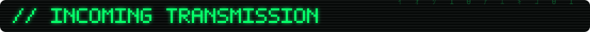
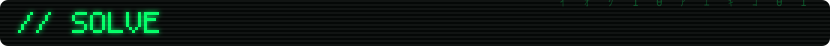
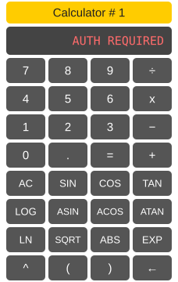
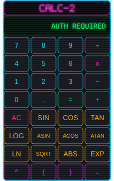

<!--

  ────────────────────────────────────────────────────────────────────────────
  You found the raw view. Good instinct. Nothing is hidden here — no answer
  in this file, no key, no
  base64 worth decoding, no clever comment further down. I checked; that's
  what the verification suite is for.

  The gate is AES-256-GCM. The key derives from the solution to the equation
  below via PBKDF2-SHA256 at 600,000 iterations. The ciphertext ships in the
  open at github.com/llmspace/theta-auth — read every line of it if you like.
  Reading it will tell you exactly how the lock works and will not open it.

  The only way through is the mathematics. That's the whole point.
  ────────────────────────────────────────────────────────────────────────────

-->

<div align="center">
<a href="#"></a>
</div>

<!-- LEADERBOARD:START -->
<div align="center">
<a href="#"></a>
<br>
<sub>top 10 shown · full hall of fame in <a href="https://github.com/llmspace/llmspace/blob/main/SOLVERS.md">SOLVERS.md</a></sub>
</div>
<!-- LEADERBOARD:END -->

<div align="center">
<a href="#"></a>
</div>

<div align="center">

### θ

</div>

```
llmspace@theta ~ % ./gate --status

SESSION   : null
GATE 1    : sealed    aes-256-gcm  ·   6 decimals
GATE 2    : sealed    aes-256-gcm  ·  12 decimals
BACKEND   : none — verification is local and offline
```

**Find θ such that**

```
sin(θ) + cos(θ) = log(θ) · e^θ
```

θ is in radians. `log` is base 10. `e` is Euler's number. The root lies between 1 and 2.

Check a candidate by feeding it back through the rearrangement — a correct θ returns itself:

```
LN( (SIN(θ) + COS(θ)) / LOG(θ) ) = θ
```

**Gate 1** opens at six decimals. Patience and the calculators below will get you there.
**Gate 2** opens at twelve. They will not.

Everyone who opens gate 2 gets a line on the board — name, method, date, by pull
request against [SOLVERS.md](https://github.com/llmspace/llmspace/blob/main/SOLVERS.md).
That is the whole prize.

<div align="center">
<a href="#"></a>
</div>

<div align="center">
<a href="https://llmspace.github.io/theta-auth/"></a><a href="https://llmspace.github.io/theta-auth/"></a><a href="https://llmspace.github.io/theta-auth/"></a>
</div>

<div align="center">

### [→ open the terminal](https://llmspace.github.io/theta-auth/)

<sub>the buttons above are images — they hand off, they don't compute</sub>

</div>

---

<details>
<summary><b>SYSTEM DIAGNOSTIC 0x01 — what happens when you press UNLOCK</b></summary>

<br>

Your input is normalised with `toFixed(6)` and `toFixed(12)`, then run through
PBKDF2-SHA256 at 600,000 iterations to derive two AES-256-GCM keys. Those keys are
tried against two ciphertexts shipped with the page.

Wrong answer, and the GCM authentication tag fails to verify. That failure is
indistinguishable from a corrupted file — you get no signal about how close you were.
There's no oracle, because there's nothing to ask: no server is contacted, no answer
is stored, and nothing in the repository can check a guess more cheaply than the gate
itself.

Brute force is bounded by precision rather than by iteration count. The riddle
already tells you the root lies between 1 and 2, so twelve decimals is 10¹²
candidates — roughly two GPU-years at this iteration count. Six decimals is 10⁶ —
about twenty seconds. That asymmetry is why gate 1 is a hint and gate 2 is the
prize.

</details>

<details>
<summary><b>SYSTEM DIAGNOSTIC 0x02 — recovery procedure</b></summary>

<br>

There isn't one. Nothing here can be reset, recovered, or requested. If the answer ever
becomes public, the gate stands open permanently for everyone — the ciphertext is
already sitting on every visitor's machine, so there is nothing left to revoke.

That's a property of every client-side gate ever built, not a flaw in this one. It's
also fine: the prize is a scoreboard, and a scoreboard nobody reaches is just a
locked door.

</details>

---

<div align="center">
<sub>
no analytics · no cookies · no backend · <a href="https://github.com/llmspace/theta-auth">source</a> · <a href="SOLVERS.md">solvers</a>
</sub>
</div>
